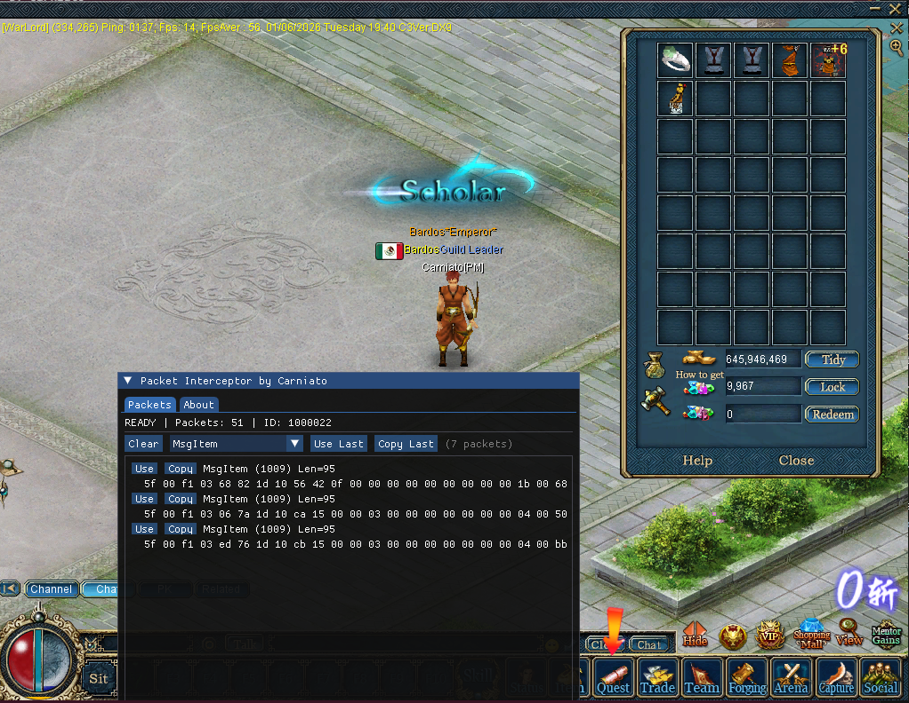

# Conquer Packet Interceptor

**⭐ If you find this project useful for learning, please consider giving it a star!** ⭐ 



- **Packet Interception**: Hooking `SendPacket` to capture network packets **before encryption**
- **Packet Injection**: Injecting custom packets using the original `SendPacket` function

### Function Signature

```cpp
// Function signature (from IDA Pro analysis)
// Address: 0x007414F0 (Conquer Online client version 6609 only)
int __fastcall SendPacket(
    void* thisPtr,      // Network object (ECX register)
    void* edx,          // Unused (EDX register)
    void* data,         // Packet data (NOT encrypted!)
    int len             // Packet size
)
```

**Note**: This address (`0x007414F0`) is specific to **Conquer Online client version 6609 only**.

## Building

1. Open `conquer-packet-interceptor.sln` in Visual Studio
2. Select **Release | Win32** configuration
3. Build Solution (F7)

The output DLL will be in `Release/Chat.dll`

## Usage

1. **Build** the project
2. **Rename** `Release/Chat.dll` to match the game's expected DLL name
3. **Place** the DLL in the game's directory
4. **Launch** the game
5. **Press `INSERT`** to toggle the ImGui overlay


## Acknowledgments

- **MinHook**
- **ImGui**

---

**Note**: This is a **study/research project**.
